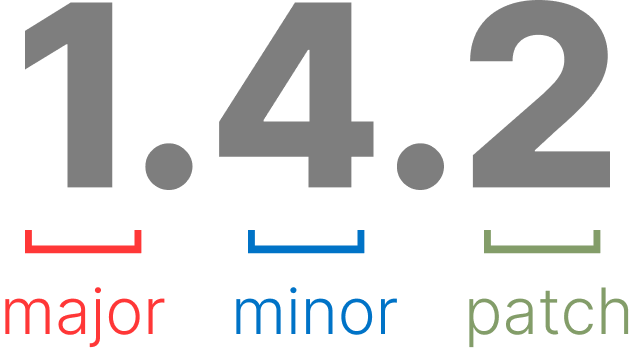

# Elucidário.art

Em linhas gerais o Elucidário.art é um _Collection Management System_. A abreviação CMS é majoritariamente conhecida com um outro significado: _Content Management System_, devido a popularidade de plataformas como WordPress, Joomla, Drupal, etc. O Elucidário.art é um CMS para coleções de arte, ou seja, é um sistema de gerenciamento de coleções de arte, ou um _Content Management System_ especializado. Portanto utilizaremos a abreviação CMS para nos referirmos ao Elucidário como um _Collection Management System_. Este termo também é utilizado por instituições como _Collections Trust_ e ICOM para referir-se a esta modalidade de software.

Em suma, o Elucidário.art consiste em um plugin para WordPress que define um conjunto de funcionalidades para gerenciamento de coleções de arte. O plugin utiliza o modelo de dados para aplicações Linked Art para definição das classes principais de conteúdo e se baseia nos procedimentos Spectrum para definição de seus fluxos de trabalho.

## O Repositório

As principais linguagens de programação utilizadas no código-fonte do Elucidário.art são PHP 8.2 (PHP, 2023), TypeScript (MICROSOFT, 2023), JavaScript (MDN, 2022) e JSON (BRAY; IETF, 2017), e, estão estruturadas em um repositório utilizando a arquitetura _monorepo_, ou seja, um repositório que contém múltiplos projetos (NARWHAL TECHNOLOGIES INC., 2022). Optamos por utilizar esta arquitetura para facilitar o desenvolvimento e a manutenção do código-fonte, pois desta forma podemos reutilizar pacotes em diferentes projetos, como em bibliotecas, plugins, temas, etc. Esta arquitetura também pode ser chamada de micro-serviços (_microservices_), onde cada pacote é um serviço que pode ser desenvolvido, testado e publicado de maneira independente, o que facilita a manutenção e estimula a evolução independente de cada pacote.

Utilizamos o Git (TORVALDS; HAMANO, 2005) para o controle de versão dos pacotes, o GitHub (GITHUB, 2008) para hospedagem do repositório e o Versionamento Semântico (_Semantic Versioning_ ou _SemVer_) (SEMVER, 2023) para definição das versões públicas dos pacotes. O SemVer define três tipos diferentes de incrementação de versão: _major_, _minor_ e _patch_. O _major_ é incrementado quando há mudanças incompatíveis na API, ou seja, quando a forma de usar as suas funções, métodos, classes, e etc, são alteradas; o _minor_ é incrementado quando há adição de funcionalidades compatíveis com versões anteriores; e o _patch_ é incrementado quando há correção de _bugs_, também compatíveis com versões anteriores.

**Exemplo de Versionamento Semântico (SemVer)**



Para assegurarmos a qualidade do código-fonte, e se seus objetivos estão sendo atingidos, criamos um conjunto de testes automatizados para cada um dos pacotes, configurados especificamente para cada linguagem de programação e ambiente. Estes testes rodam automaticamente no ambiente local a cada nova alteração no código-fonte adicionada ao controle de versão utilizando a biblioteca Husky (TYPICODE, 2018), e em um ambiente de integração contínua (_CI_) (sincronização remota) utilizando o GitHub Actions (GITHUB, 2018).

O repositório pode ser acessado no link [https://github.com/hgodinho/elucidario](https://github.com/hgodinho/elucidario) e, em resumo, é organizado da seguinte forma:

```bash
elucidario
├── packages
├── apps
├── publications
├── references
├── ...
```

O diretório `packages` contém os pacotes que podem ser reutilizados, tanto por outros pacotes, como por aplicações. Todos os pacotes definidos nesta pasta seguem o padrão de nome `@elucidario/pkg-<nome-pacote>`.

No diretório `apps`, se encontram as aplicações, como um ambiente de desenvolvimento completo utilizando Docker para testes locais e o site do Elucidário.art disponível em [https://elucidario.art/](https://elucidario.art/). Os pacotes nesta pasta seguem o padrão de nome `@elucidario/app-<nome-pacote>`.

O diretório `publications` contém as publicações referentes ao Elucidário.art, como a dissertação de mestrado e outros artigos desenvolvidos ao longo da pesquisa. Os pacotes nesta pasta seguem o padrão de nome `@elucidario/pub-<nome-pacote>`.

No diretório `references` contém referências utilizadas no desenvolvimento de todo o ecossistema do Elucidário.art e estão organizadas em um arquivo JSON para cada referência seguindo o formato _Citation Style Language_ (CSL) (D’ARCUS, 2010).

Todos os pacotes nos diretórios `apps` e `packages` foram construídos levando em conta os seguintes princípios de design, ou técnicas de programação:

- a11y (_accessibility_) - quando aplicável o pacote deve seguir as regras de acessibilidade apropriadas para o contexto;
- i10n (_localization_) - quando aplicável o pacote deve implementar o suporte a localização dos idiomas português, espanhol e inglês, seguindo esta ordem de prioridade;
- i18n (_internationalization_) - quando aplicável o pacote deve implementar o suporte a internacionalização, e o processo de localização deve ser devidamente documentado;

Os pacotes principais do diretório _packages_ são:

- `@elucidario/pkg-mdorim` - Pacote que define o modelo de dados utilizado no sistema;
- `@elucidario/pkg-design-system` - Pacote que define o sistema de design utilizado no aplicativo;
- `@elucidario/pkg-core` - Pacote principal do Elucidário.art, integra os demais pacotes e define as funcionalidades principais do sistema, como banco de dados, rotas, páginas administrativas, configurações, usuários, permissões de usuários, etc;
