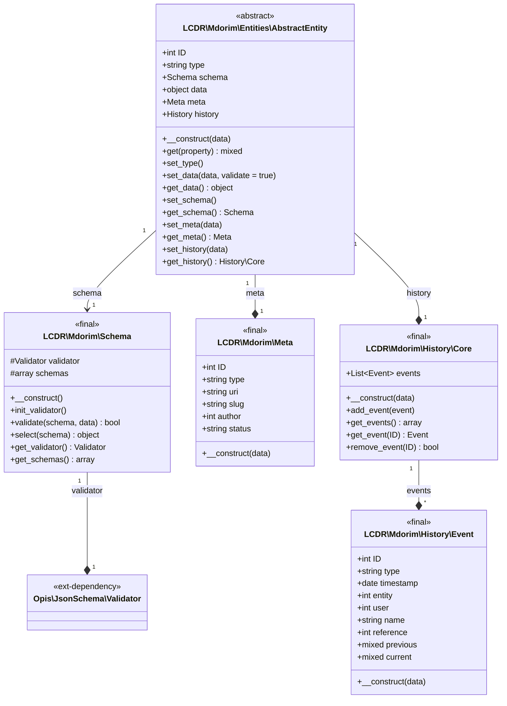

# `@elucidario.art/core`

Plugin Elucidário.art

Sistema de Gestão de Coleções

## LCDR\Abstracts\Mdorim\Entity

```mermaid
    classDiagram

        AbstractEntity "1" --> "1" Schema : schema
        Schema "1" --* "1" Validator : validator
        AbstractEntity "1" --* "1" Meta : meta
        AbstractEntity "1" --* "1" History : history

        History "1" --* "*" Event : events

        class AbstractEntity["LCDR\Mdorim\Entities\AbstractEntity"] {
            <<abstract>>

            +int ID
            +string type
            +Schema schema
            +object data
            +Meta meta
            +History history

            +__construct(data)
            +get(property) mixed
            +set_type()
            +set_data(data, validate = true)
            +get_data() object
            +set_schema()
            +get_schema() Schema
            +set_meta(data)
            +get_meta() Meta
            +set_history(data)
            +get_history() History\Core
        }

        class Schema["LCDR\Mdorim\Schema"] {
            <<final>>

            #Validator validator
            #array schemas

            +__construct()
            +init_validator()
            +validate(schema, data) bool
            +select(schema) object
            +get_validator() Validator
            +get_schemas() array
        }

        class Validator["Opis\JsonSchema\Validator"] {
            <<ext-dependency>>
        }

        class History["LCDR\Mdorim\History\Core"] {
            <<final>>

            +List~Event~ events

            +__construct(data)
            +add_event(event)
            +get_events() array
            +get_event(ID) Event
            +remove_event(ID) bool
        }

        class Event["LCDR\Mdorim\History\Event"] {
            <<final>>

            +int ID
            +string type
            +date timestamp
            +int entity
            +int user
            +string name
            +int reference
            +mixed previous
            +mixed current

            +__construct(data)
        }

        class Meta["LCDR\Mdorim\Meta"] {
            <<final>>

            +int ID
            +string type
            +string uri
            +string slug
            +int author
            +string status

            +__construct(data)
        }
```
