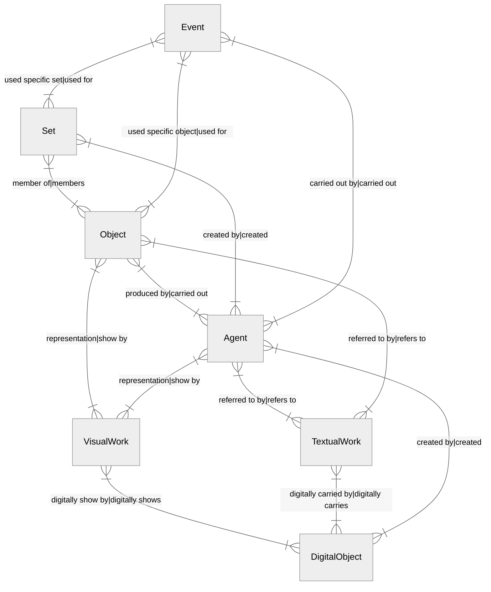

# (MDORIM) Modelo de Dados para Organização e Representação da Informação Museológica

```mermaid
%%{init: { 'theme': 'neutral', 'themeVariables': {  } } }%%
erDiagram
    Agent
    Object
    Set
    Event
    VisualWork
    TextualWork
    DigitalObject

    Object }|--|{ Agent : "produced by|carried out"

    Set }|--|{ Agent : "created by|created"
    Set }|--|{ Object : "member of|members"

    Object }|--|{ VisualWork : "representation|show by"
    Agent }|--|{ VisualWork : "representation|show by"

    Agent }|--|{ TextualWork : "referred to by|refers to"
    Object }|--|{ TextualWork : "referred to by|refers to"

    VisualWork }|--|{ DigitalObject : "digitally show by|digitally shows"
    TextualWork }|--|{ DigitalObject : "digitally carried by|digitally carries"

    Event }|--|{ Object : "used specific object|used for"
    Event }|--|{ Set : "used specific set|used for"

    Event }|--|{ Agent : "carried out by|carried out"
    DigitalObject }|--|{ Agent : "created by|created"
```
