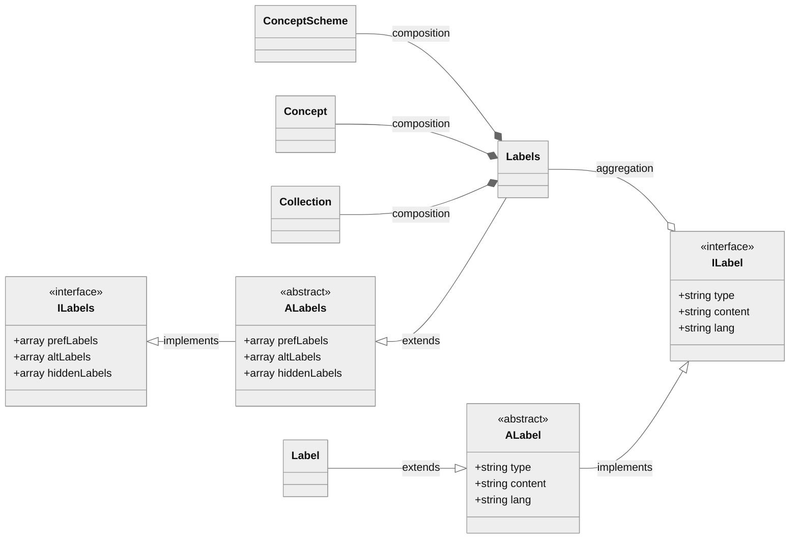

# Diagrama de classes para Labels

```mermaid
%%{init: { 'theme': 'neutral', 'themeVariables': {  } } }%%
    classDiagram
        direction LR
        %% LABEL
        Labels --o ILabel : aggregation
        ConceptScheme --* Labels : composition
        Concept --* Labels : composition
        Collection --* Labels : composition

        ALabels <|-- Labels : extends
        ILabels <|-- ALabels : implements

        Label --|> ALabel : extends
        ALabel --|> ILabel : implements

        class ILabels {
            <<interface>>
            +array prefLabels
            +array altLabels
            +array hiddenLabels
        }

        class ALabels {
            <<abstract>>
            +array prefLabels
            +array altLabels
            +array hiddenLabels
        }

        class Labels

        class Label 

        class ILabel {
            <<interface>>
            +string type
            +string content
            +string lang
        }

        class ALabel {
            <<abstract>>
            +string type
            +string content
            +string lang
        }
```