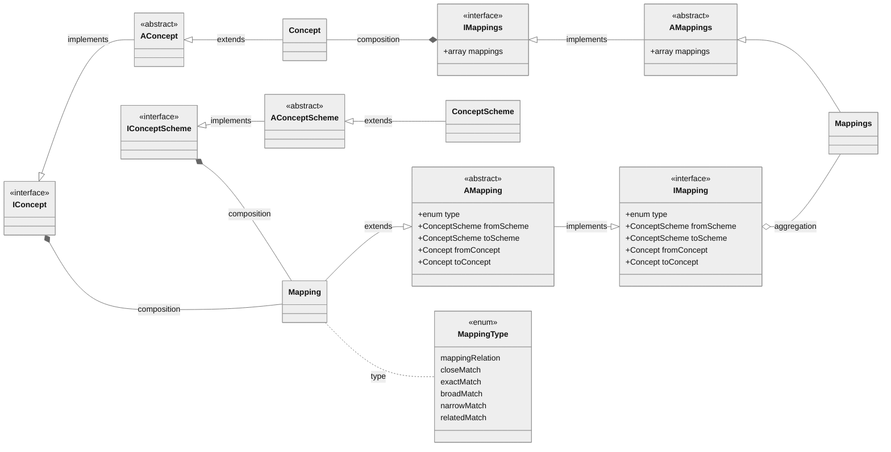

# Diagrama de classes para Mappings

```mermaid
%%{init: { 'theme': 'neutral', 'themeVariables': {  } } }%%
    classDiagram
        direction LR
        %% MAPPING

        IConcept <|-- AConcept : implements
        AConcept <|-- Concept : extends

        IConceptScheme <|-- AConceptScheme : implements
        AConceptScheme <|-- ConceptScheme : extends

        Concept --* IMappings : composition
        IMappings <|-- AMappings : implements
        AMappings <|-- Mappings

        IMapping o-- Mappings : aggregation
        AMapping --|> IMapping : implements
        Mapping --|> AMapping : extends

        IConceptScheme *-- Mapping : composition
        IConcept *-- Mapping : composition

        Mapping .. MappingType : type

        class MappingType {
            <<enum>>
            mappingRelation
            closeMatch
            exactMatch
            broadMatch
            narrowMatch
            relatedMatch
        }

        class Concept

        class AConcept {
            <<abstract>>
        }
        
        class IConcept {
            <<interface>>
        }

        class ConceptScheme

        class AConceptScheme {
            <<abstract>>
        }
        
        class IConceptScheme {
            <<interface>>
        }

        class Mappings 

        class AMappings {
            <<abstract>>
            +array mappings
        }

        class IMappings {
            <<interface>>
            +array mappings
        }

        class Mapping

        class AMapping {
            <<abstract>>
            +enum type
            +ConceptScheme fromScheme
            +ConceptScheme toScheme
            +Concept fromConcept
            +Concept toConcept
        }

        class IMapping {
            <<interface>>
            +enum type
            +ConceptScheme fromScheme
            +ConceptScheme toScheme
            +Concept fromConcept
            +Concept toConcept
        }

```