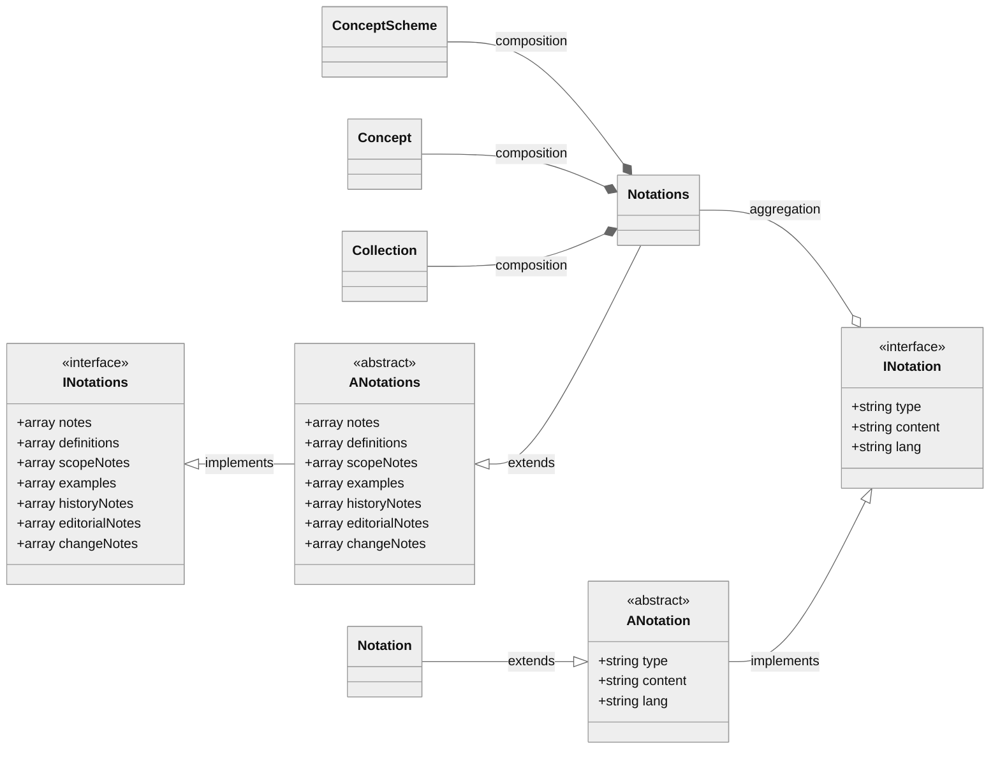

# Diagrama de classes para Notations

```mermaid
%%{init: { 'theme': 'neutral', 'themeVariables': {  } } }%%
    classDiagram
        direction LR
        %% Notation
        Notations --o INotation : aggregation
        ConceptScheme --* Notations : composition
        Concept --* Notations : composition
        Collection --* Notations : composition

        ANotations <|-- Notations : extends
        INotations <|-- ANotations : implements

        Notation --|> ANotation : extends
        ANotation --|> INotation : implements

        class INotations {
            <<interface>>
            +array notes
            +array definitions
            +array scopeNotes
            +array examples
            +array historyNotes
            +array editorialNotes
            +array changeNotes
        }

        class ANotations {
            <<abstract>>
            +array notes
            +array definitions
            +array scopeNotes
            +array examples
            +array historyNotes
            +array editorialNotes
            +array changeNotes
        }

        class Notations

        class Notation 

        class INotation {
            <<interface>>
            +string type
            +string content
            +string lang
        }

        class ANotation {
            <<abstract>>
            +string type
            +string content
            +string lang
        }
```