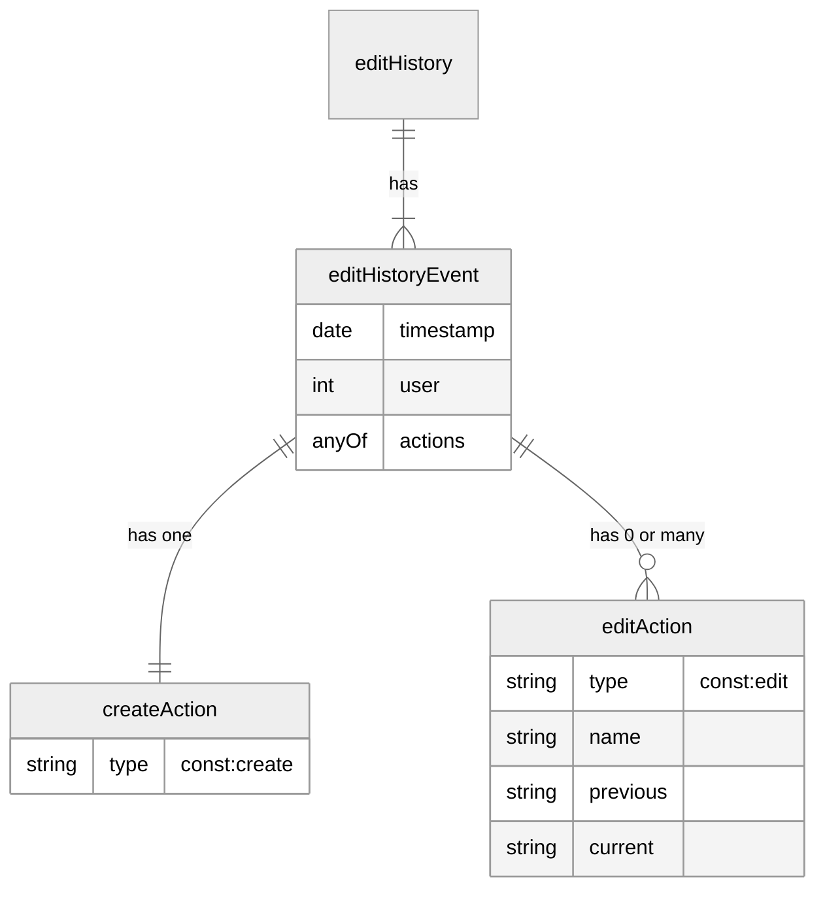

# Histórico

```mermaid
%%{init: { 'theme': 'neutral', 'themeVariables': {  } } }%%
    erDiagram

        editHistory

        editHistoryEvent {
            date timestamp
            int user
            anyOf actions
        }

        createAction {
            string type "const:create"
        }

        editAction {
            string type "const:edit"
            string name
            string previous
            string current
        }

        editHistory ||--|{ editHistoryEvent : "has"

        editHistoryEvent ||--|| createAction : "has one"
        editHistoryEvent ||--o{ editAction : "has 0 or many"
```
