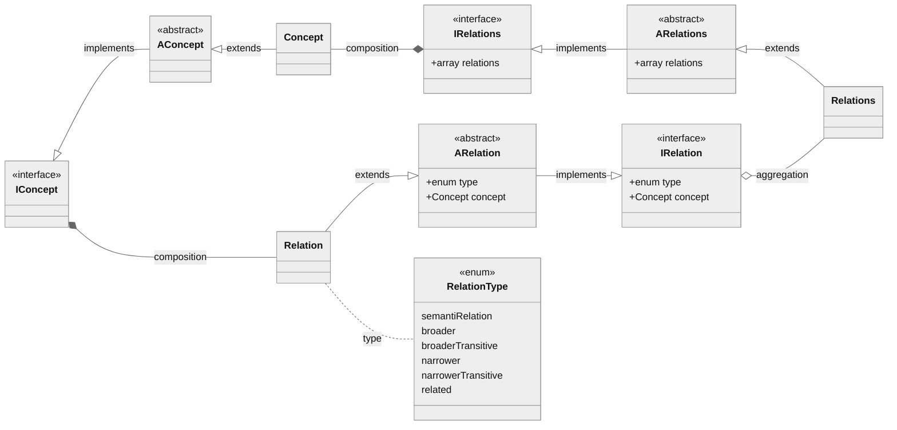

# Diagrama de classes para Relations

```mermaid
%%{init: { 'theme': 'neutral', 'themeVariables': {  } } }%%
    classDiagram
        direction LR
        %% RELATION

        Concept --* IRelations : composition
        IRelations <|-- ARelations : implements
        ARelations <|-- Relations : extends

        IRelation o-- Relations : aggregation
        ARelation --|> IRelation : implements
        Relation --|> ARelation : extends
    
        IConcept *-- Relation : composition

        IConcept <|-- AConcept : implements
        AConcept <|-- Concept : extends

        Relation .. RelationType : type

        class RelationType {
            <<enum>>
            semantiRelation
            broader
            broaderTransitive
            narrower
            narrowerTransitive
            related
        }

        class Concept

        class AConcept {
            <<abstract>>
        }
        
        class IConcept {
            <<interface>>
        }

        class Relations

        class ARelations {
            <<abstract>>
            +array relations
        }

        class IRelations {
            <<interface>>
            +array relations
        }

        class Relation

        class ARelation {
            <<abstract>>
            +enum type
            +Concept concept
        }

        class IRelation {
            <<interface>>
            +enum type
            +Concept concept
        }
```