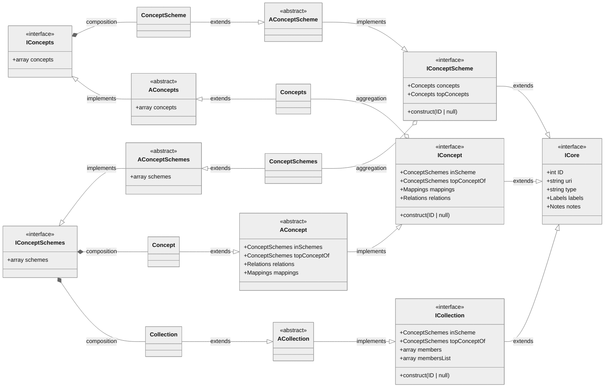

# Diagrama de classes

## Classes principais

```mermaid
%%{init: { 'theme': 'neutral', 'themeVariables': {  } } }%%
    classDiagram
        direction LR

        %% CORE
        class ICore {
            <<interface>>
            +int ID
            +string uri
            +string type
            +Labels labels
            +Notes notes
        }

        IConceptScheme --|> ICore : extends 


        %% CONCEPT-SCHEME
        ConceptSchemes --o IConceptScheme: aggregation
        IConceptSchemes <|-- AConceptSchemes: implements
        AConceptSchemes <|-- ConceptSchemes: extends

        AConceptScheme --|> IConceptScheme: implements
        ConceptScheme --|> AConceptScheme: extends

        IConcepts *-- ConceptScheme : composition

        class ConceptScheme

        class IConceptScheme {
            <<interface>>
            +Concepts concepts
            +Concepts topConcepts
            +construct(ID | null)
        }

        class AConceptScheme {
            <<abstract>>
        }

        class IConceptSchemes {
            <<interface>>
            +array schemes
        }

        class AConceptSchemes {
            <<abstract>>
            +array schemes
        }

        class ConceptSchemes

        %% CONCEPT
        Concepts --o IConcept : aggregation
        IConcepts <|-- AConcepts: implements
        AConcepts <|-- Concepts: extends

        AConcept --|> IConcept : implements
        Concept --|> AConcept : extends

        IConcept --|> ICore : extends

        IConceptSchemes *-- Concept  : composition

        class AConcept {
            <<abstract>>
            +ConceptSchemes inSchemes
            +ConceptSchemes topConceptOf
            +Relations relations
            +Mappings mappings
        }

        class Concept

        class IConcept {
            <<interface>>
            +ConceptSchemes inScheme
            +ConceptSchemes topConceptOf
            +Mappings mappings
            +Relations relations
            +construct(ID | null)
        }

        class Concepts

        class AConcepts {
            <<abstract>>
            +array concepts
        }

        class IConcepts {
            <<interface>>
            +array concepts
        }

        %% COLLECTIONS
        ICollection --|> ICore : extends 
        ACollection --|> ICollection : implements
        Collection --|> ACollection : extends

        IConceptSchemes *-- Collection  : composition

        class Collection

        class ICollection {
            <<interface>>
            +ConceptSchemes inScheme
            +ConceptSchemes topConceptOf
            +array members
            +array membersList
            +construct(ID | null)
        }

        class ACollection {
            <<abstract>>
        }
```