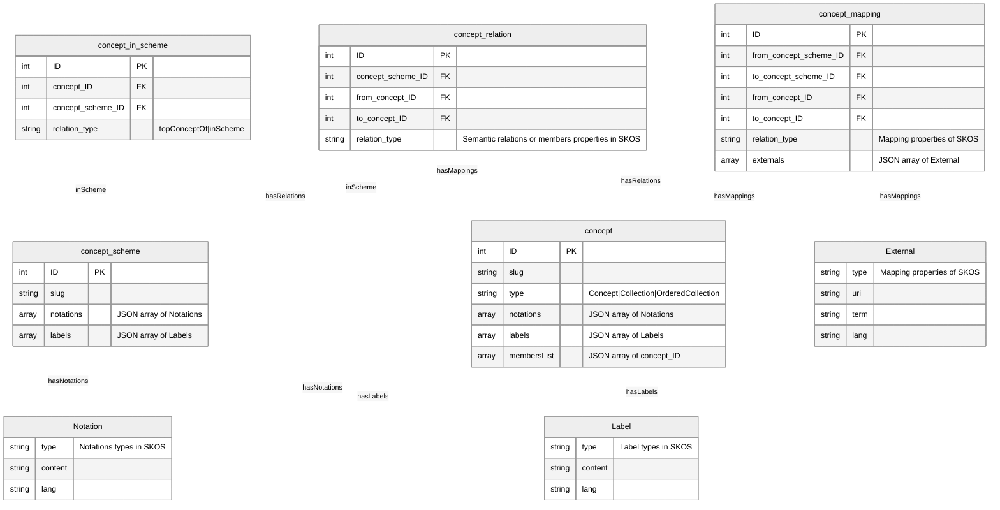

# Database diagram

```mermaid
%%{init: { 'theme': 'neutral', 'themeVariables': { 'lineColor': '#fff' } } }%%
    erDiagram
        concept_mapping ||--|{ concept : "hasMappings"
        concept_mapping ||--|{ concept_scheme : "hasMappings"
        concept_mapping ||..o{ External : "hasMappings"

        concept_relation ||--|{ concept : "hasRelations"
        concept_relation ||--|| concept_scheme : "hasRelations"

        concept_in_scheme ||--|| concept_scheme : "inScheme"
        concept_in_scheme ||--|| concept : "inScheme"

        concept ||..o{ Notation : "hasNotations"
        concept_scheme ||..o{ Notation : "hasNotations"

        concept ||..|{ Label : "hasLabels"
        concept_scheme ||..|{ Label : "hasLabels"


        Label {
            string type "Label types in SKOS"
            string content
            string lang
        }

        Notation {
            string type "Notations types in SKOS"
            string content
            string lang
        }

        External {
            string type "Mapping properties of SKOS"
            string uri
            string term
            string lang
        }

        concept {
            int ID PK
            string slug
            string type "Concept|Collection|OrderedCollection"
            array notations "JSON array of Notations"
            array labels "JSON array of Labels"
            array membersList "JSON array of concept_ID"
        }

        concept_scheme {
            int ID PK
            string slug
            array notations "JSON array of Notations"
            array labels "JSON array of Labels"
        }

        concept_relation {
            int ID PK
            int concept_scheme_ID FK
            int from_concept_ID FK
            int to_concept_ID FK
            string relation_type "Semantic relations or members properties in SKOS"
        }

        concept_mapping {
            int ID PK
            int from_concept_scheme_ID FK
            int to_concept_scheme_ID FK
            int from_concept_ID FK
            int to_concept_ID FK
            string relation_type "Mapping properties of SKOS"
            array externals "JSON array of External"
        }

        concept_in_scheme {
            int ID PK
            int concept_ID FK
            int concept_scheme_ID FK
            string relation_type "topConceptOf|inScheme"
        }

```
