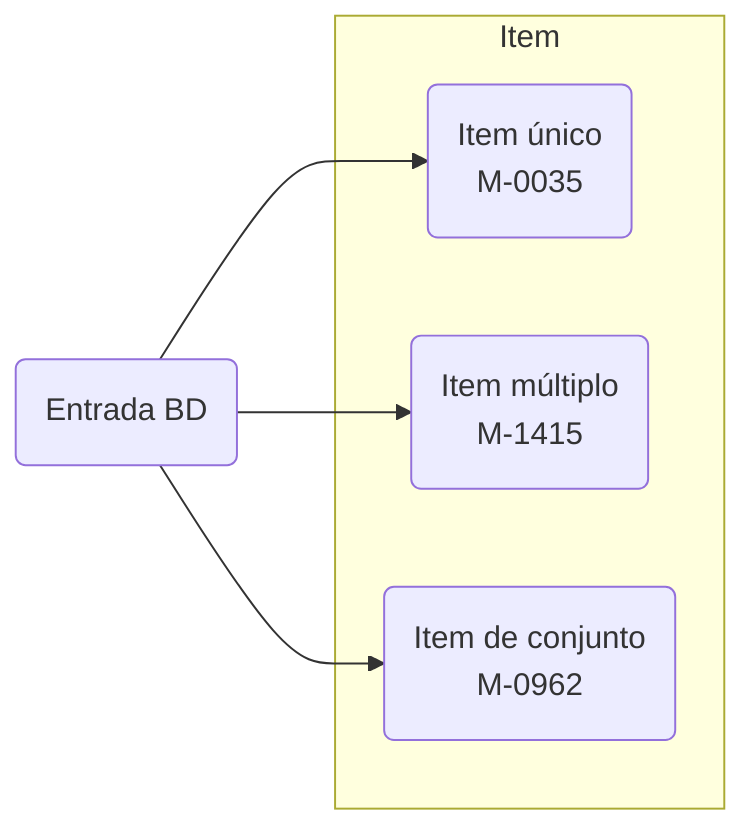

```mermaid
    flowchart LR
        entrada(Entrada BD)

        subgraph Item
            unico(Item único\nM-0035)

            multiplo(Item múltiplo\nM-1415)

            conjunto(Item de conjunto\nM-0962)
        end

        entrada --> unico
        entrada --> multiplo
        entrada --> conjunto

```
