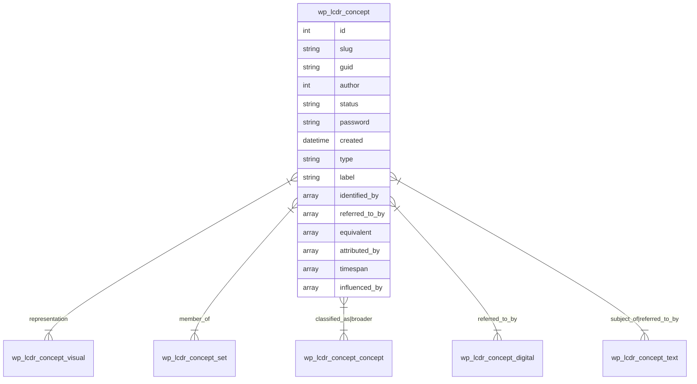

```mermaid
    erDiagram
        wp_lcdr_concept {
            int id
            string slug
            string guid
            int author
            string status
            string password
            datetime created

            string type
            string label
            array identified_by
            array referred_to_by
            array equivalent
            array attributed_by
            array timespan
            array influenced_by
        }

        wp_lcdr_concept }|--|{ wp_lcdr_concept_visual : "representation"
        wp_lcdr_concept }|--|{ wp_lcdr_concept_set : "member_of"
        wp_lcdr_concept }|--|{ wp_lcdr_concept_concept : "classified_as|broader"
        wp_lcdr_concept }|--|{ wp_lcdr_concept_digital : "referred_to_by"
        wp_lcdr_concept }|--|{ wp_lcdr_concept_text : "subject_of|referred_to_by"
```
