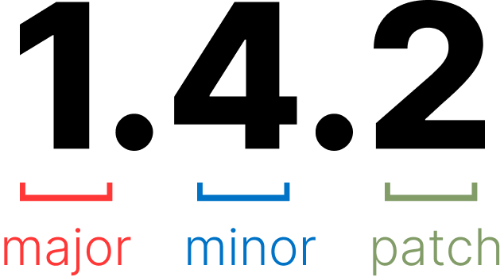

# 9. Elucidario.art

Em linhas gerais o Elucidário.art é um _Collection Management System_. A abreviação CMS é majoritariamente conhecida com um outro significado: _Content Management System_, devido a popularidade de plataformas como WordPress, Joomla, Drupal, etc. O Elucidário.art é um CMS para coleções de arte, ou seja, é um sistema de gerenciamento de coleções de arte, ou um _Content Management System_ especializado. Portanto utilizaremos a abreviação CMS para nos referirmos ao Elucidário como um _Collection Management System_. Este termo também é utilizado por instituições como _Collections Trust_ e ICOM para referir-se a esta modalidade de software.

Em suma, o Elucidário.art consiste em um plugin para WordPress que define um conjunto de funcionalidades para gerenciamento de coleções de arte. O plugin utiliza o modelo de dados para aplicações Linked Art para definição das classes principais de conteúdo e se baseia nos procedimentos Spectrum para definição de seus fluxos de trabalho.

Para o entendimento das seções a seguir, é importante primeiro definirmos alguns conceitos:

**a11y (accessibility)**: é a acessibilidade de um sistema, ou seja, a adaptação de um sistema para diferentes necessidades de acessibilidade. O termo a11y é uma abreviação de "_accessibility_" que contém 11 letras entre a letra "a" e a letra "y".

**Administrador**: é o usuário que gerencia o sistema. É o usuário que tem acesso ao endereço '<https://exemplo.com/wp-admin>' ou qualquer outra URI de gerenciamento do sistema.

**_Application Programming Interface_ (API)**: é um conjunto de rotinas e padrões de programação para acesso a um aplicativo, software ou plataforma de forma programática.

**_Back-end_**: é a parte do sistema que não é visível para o usuário. É a parte do sistema que gerencia os dados e a lógica de negócio.

**Bloco Gutemberg**: é uma funcionalidade do WordPress que facilita a reutilização de componentes de interface de usuário. Os blocos Gutemberg são utilizados para construir páginas e postagens no WordPress, e utilizam a biblioteca React para construção das interfaces.

**Componente React**: é um componente de interface de usuário desenvolvido utilizando a biblioteca React [@meta-open-source2023]. Os componentes são utilizados como blocos de construção no desenvolvimento de interfaces de usuário.

**_Continuous Integration_ (CI)**: é uma prática de desenvolvimento de software onde desenvolvedores integram o código em um repositório compartilhado frequentemente, geralmente várias vezes ao dia. Cada integração é verificada por um processo de compilação automatizado (incluindo testes) para detectar erros de integração o mais rápido possível.

**Docker** [@hykes2013]: é uma plataforma de código aberto para desenvolvimento, envio e execução de aplicativos. O Docker permite que os desenvolvedores empacotem um aplicativo com todas as partes de que ele precisa, como bibliotecas e outras dependências, e enviem tudo como um pacote. Ao fazer isso, graças à padronização, o Docker permite que o aplicativo seja executado em qualquer lugar, seja em um notebook, em um servidor físico, em uma máquina virtual ou em um ambiente em nuvem.

**_Front-end_**: é o conjunto de tecnologias e ferramentas utilizadas para construção da interface de usuário. É a parte do sistema que é visível para o usuário, esta diretamente relacionada a _User Interface_ (UI).

**_Headless_**: é utilizado para referir-se a sistemas que não possuem uma interface de usuário final (UI), mas possuem uma API Rest para leitura e escrita. Um sistema _headless_ pode ser utilizado como _back-end_ para um sistema _front-end_, e sua API pode ser utilizada para construção de interfaces de usuário em diferentes plataformas, como aplicações web, mobile, etc.

**i18n (internationalization)**: é a internacionalização de um sistema, ou seja, a adaptação de um sistema para diferentes idiomas e culturas. O termo i18n é uma abreviação de "_internationalization_" que contém 18 letras entre a letra "i" e a letra "n".

**i10n (localization)**": é a localização de um sistema, ou seja, a adaptação de um sistema para uma cultura e idioma específico. O termo i10n é uma abreviação de "_localization_" que contém 10 letras entre a letra "i" e a letra "n".

**_Localhost_**: é o endereço local do sistema, geralmente é acessado através do endereço "<http://localhost:8000>".

**Pacotes**: no contexto de desenvolvimento de software, "pacote" é um termo utilizado para definir um conjunto de arquivos e diretórios que contém código-fonte, configurações, testes, arquivos, etc. Um pacote pode ser um plugin, um tema, uma biblioteca, um módulo, entre outras coisas. No nosso contexto, os pacotes JavaScript utilizam o _Node Package Manager_ (NPM) e o _Composer_ quando há arquivos PHP no pacote para gerenciamento de dependências, e, dependendo do pacote, podem ser utilizados em diferentes ambientes, como no navegador, no Node.js, no React Native, etc. Neste contexto de pacotes JavaScript, cada pacote segue estruturas de pastas contendo um arquivo "package.json" que define as suas configurações, como nome, versão, dependências, _scripts_, etc. Este mesmo conceito também se aplica para o PHP, onde cada pacote segue estruturas de pastas contendo um arquivo "composer.json" que, assim como o "package.json", define as suas configurações, como nome, versão, dependências, _scripts_, etc.

**_User Interface_ (UI)**: é a interface do usuário, ou seja, a parte do sistema que é visível e possibilita a interação com o usuário, está diretamente relacionada ao _front-end_.

**_Representational State Transfer_ API (REST-API)**: é um conjunto de padrões de comunicação hipermídia entre sistemas que utiliza o protocolo HTTP para realizar requisições e respostas.

**Usuário final**: é o usuário que interage com o sistema. É o usuário que acessa o endereço '<https://exemplo.com>'.

**WAI-ARIA**: é um conjunto de atributos que podem ser adicionados a tags HTML para melhorar a acessibilidade de um sistema. O termo WAI-ARIA é uma abreviação de "_Web Accessibility Initiative - Accessible Rich Internet Applications_" [@w-3-c2022].

## 9.1. O Repositório

As principais linguagens de programação utilizadas no código-fonte do Elucidário.art são PHP 8.2 [@php2022], TypeScript [@microsoft2023], JavaScript [@mdn2022] e JSON [@ietf2017], e estão estruturadas em um repositório utilizando a arquitetura _monorepo_, ou seja, um repositório que contém múltiplos projetos [@narwhal-technologies-inc2022]. Optamos por utilizar esta arquitetura para facilitar o desenvolvimento e a manutenção do código-fonte, pois, desta forma, podemos reutilizar pacotes em diferentes projetos, como em aplicações, bibliotecas, plugins, temas, etc. Esta arquitetura também pode ser chamada de micro-serviços (_microservices_), onde cada pacote é um serviço que pode ser utilizado em diferentes projetos. Esta arquitetura de software permite que cada pacote seja desenvolvido, testado e publicado de maneira independente, o que facilita a manutenção e garante a evolução independente de cada pacote.

Utilizamos o Versionamento Semântico (_Semantic Versioning_ ou _SemVer_) [@sem-ver2023] para controle de versão dos pacotes, onde cada pacote possui uma versão independente. O SemVer define três tipos diferentes de incrementação de versão: _major_, _minor_ e _patch_. O _major_ é incrementado quando há mudanças incompatíveis na API, o _minor_ é incrementado quando há adição de funcionalidades compatíveis com versões anteriores, e o _patch_ é incrementado quando há correção de _bugs_ compatíveis com versões anteriores.

**{{count:figures;legend=Versionamento Semântico}}**



No nosso contexto, cada pacote pode operar de maneira isolada, mas são integrados e distribuídos em um único pacote final, o plugin para WordPress Elucidário.art.

O repositório pode ser acessado no link <https://github.com/hgodinho/elucidario> e, em resumo, é organizado da seguinte forma:

```bash
elucidario
├── packages
├── apps
├── publications
├── references
```

O diretório "_packages_" contém os pacotes que podem ser reutilizados tanto por outros pacotes, como por aplicações. Todos os pacotes definidos nesta pasta seguem o padrão de nome "@elucidario/pkg-\<nome-pacote\>".

No diretório "_apps_", se encontram as aplicações, como um ambiente de desenvolvimento completo utilizando Docker para testes locais e o site da documentação disponível em <http://elucidario.art/doc>. Os pacotes nesta pasta seguem o padrão de nome "@elucidario/app-\<nome-pacote\>".

O diretório "_publications_" contém as publicações referentes ao Elucidário.art, como a dissertação de mestrado e outros artigos desenvolvidos ao longo da pesquisa. Os pacotes nesta pasta seguem o padrão de nome "@elucidario/pub-\<nome-pacote\>".

No diretório "_references_" contém referências utilizadas no desenvolvimento de todo o ecossistema do Elucidário.art e estão organizadas em um arquivo JSON para cada referência seguindo o formato _Citation Style Language_ (CSL) [@d-arcus2010].

Todos os pacotes nos diretórios `apps` e `packages` foram construídos levando em conta os seguintes princípios de design, ou técnicas de programação:

-   a11y (_accessibility_) - quando aplicável o pacote deve seguir as regras de acessibilidade apropriadas para o contexto;
-   i10n (_localization_) - quando aplicável o pacote deve implementar o suporte a localização dos idiomas português, espanhol e inglês, seguindo esta ordem de prioridade;
-   i18n (_internationalization_) - quando aplicável o pacote deve implementar o suporte a internacionalização, e o processo de localização deve ser devidamente documentado;

Os pacotes principais do diretório _packages_ são:

-   "@elucidario/pkg-core" - Pacote principal do Elucidário.art, integra os demais pacotes e define as funcionalidades principais do sistema, como banco de dados, rotas, páginas administrativas, configurações, usuários, permissões de usuários, etc;
-   "@elucidario/pkg-mdorim" - Pacote que define o modelo de dados utilizado no sistema;
-   "@elucidario/pkg-design-system" - Pacote que define o sistema de design utilizado no aplicativo;
-   "@elucidario/pkg-blocks" - Pacote que define os blocos Gutemberg utilizados no WordPress;

Uma parte importante para assegurar a qualidade do código-fonte é a realização de testes automatizados. Para isso, utilizamos o _framework_ de testes Jest [@nakazawa2011] para testes unitários e de integração, e o _framework_ Cypress [@cypress2017] para testes end-to-end nos códigos-fontes escritos em JavaScript ou Typescript. Para os códigos escritos em PHP utilizaremos o framework PHPUnit [@bergmann2001] e a biblioteca Pest [@maduro2021]. Os testes são executados em um ambiente de integração contínua (_CI_) utilizando a biblioteca Husky [@typicode2018] e GitHub Actions [@github2018].

A seguir apresentamos os principais pacotes individualmente, descrevendo-os em três partes:

1. Escopo de uso do pacote;
2. Descrição de suas funcionalidades, implementação e estrutura. A descrição pode conter diagramas UML e tabelas para melhor representação de seu conteúdo;
3. Como os testes foram executados e seus resultados para garantir a qualidade de cada pacote.
