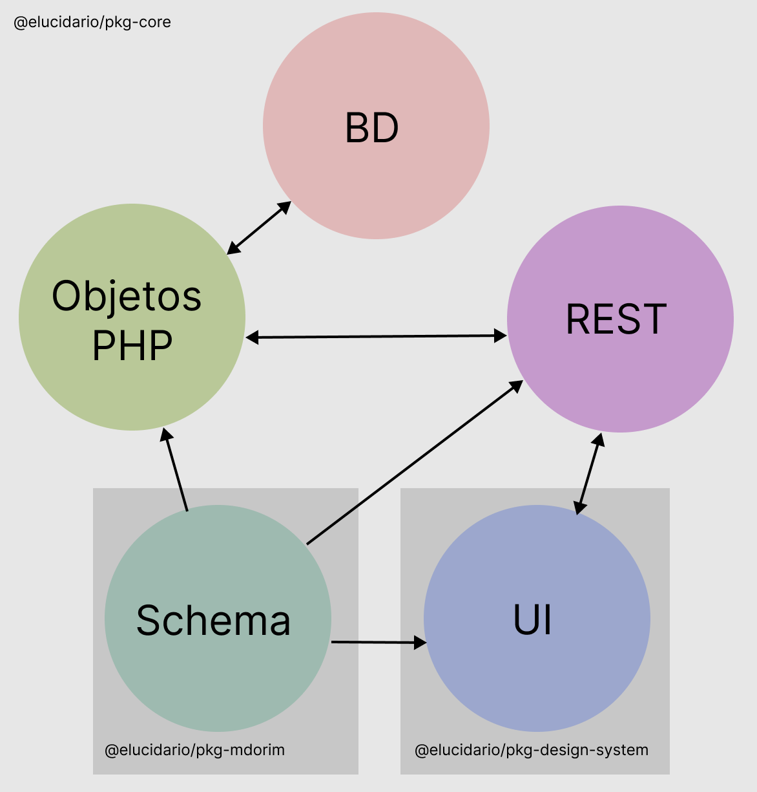

### 7.1.3 @elucidario/pkg-core

Este pacote é o plugin final. Ele pode ser instalado em diversas instâncias do WordPress, como em um ambiente local (_localhost_), uma rede privada organizacional, em uma operadora de serviços _cloud_ ou em um serviço de hospedagem compartilhada de sites. Nele definimos as principais funcionalidades do sistema como banco de dados, rotas, páginas administrativas, configurações, etc. Este pacote é o principal do Elucidário.art e agrega os demais pacotes.

**{{count:figures;legend=@elucidario/pkg-core: Estrutura do pacote principal do Elucidário.art.}}**

