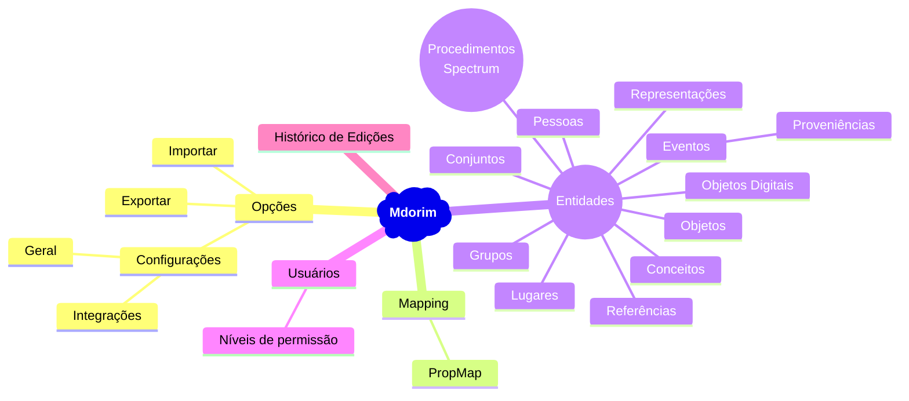

```mermaid
    mindmap
        root)"**Mdorim**"(
            Opções
                Importar
                Exportar
                Configurações
                    Geral
                    Integrações
            Mapping
                PropMap
            entidades(("Entidades"))
                Objetos
                Conceitos
                Objetos Digitais
                Referências
                Representações
                Pessoas
                Grupos
                Procedimentos(("`Procedimentos
                Spectrum`"))
                Eventos
                    Proveniências
                Lugares
                Conjuntos
            Usuários
                Níveis de permissão
            Histórico de Edições
```
