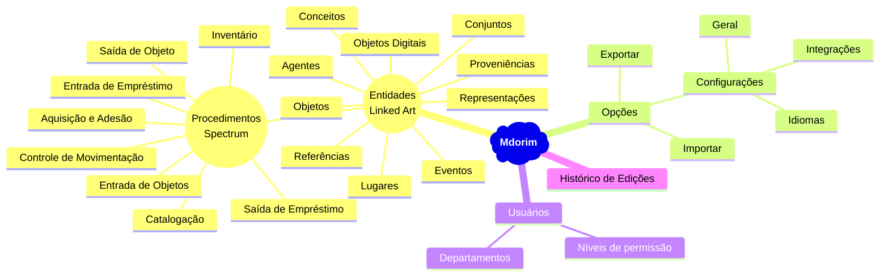

```mermaid
    mindmap
        root)"`**Mdorim**`"(
            Entidades(("`Entidades
            Linked Art`"))
                Objetos
                Conceitos
                Objetos Digitais
                Referências
                Representações
                Procedimentos(("`Procedimentos
                Spectrum`"))
                    Entrada de Objetos
                    Aquisição e Adesão
                    Controle de Movimentação
                    Inventário
                    Catalogação
                    Saída de Objeto
                    Entrada de Empréstimo
                    Saída de Empréstimo
                Agentes
                Lugares
                Eventos
                Conjuntos
                Proveniências
            Opções
                Importar
                Exportar
                Configurações
                    Geral
                    Idiomas
                    Integrações
            Usuários
                Departamentos
                Níveis de permissão
            Histórico de Edições
```
