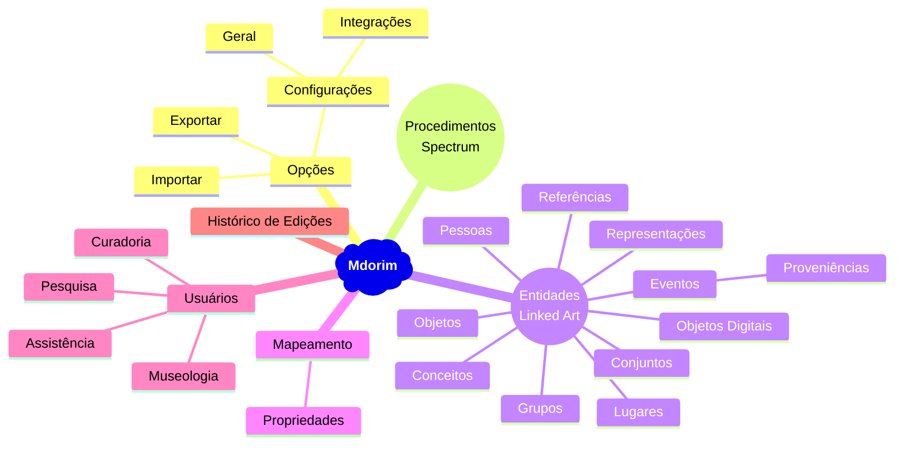

```mermaid
    mindmap
        root)"**Mdorim**"(
            Opções
                Importar
                Exportar
                Configurações
                    Geral
                    Integrações
            Procedimentos(("Procedimentos
            Spectrum"))
            entidades(("Entidades
            Linked Art"))
                Objetos
                Conceitos
                Objetos Digitais
                Referências
                Representações
                Pessoas
                Grupos
                Eventos
                    Proveniências
                Lugares
                Conjuntos
            Mapeamento
                Propriedades
            Usuários
                Curadoria
                Museologia
                Assistência
                Pesquisa
            Histórico de Edições
```
