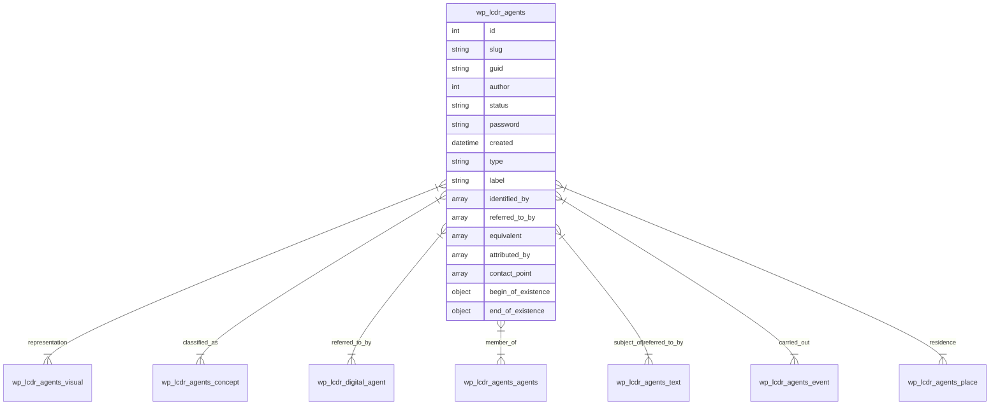

```mermaid
    erDiagram
        wp_lcdr_agents {
            int id
            string slug
            string guid
            int author
            string status
            string password
            datetime created

            string type
            string label
            array identified_by
            array referred_to_by
            array equivalent
            array attributed_by

            array contact_point
            object begin_of_existence
            object end_of_existence
        }

        wp_lcdr_agents }|--|{ wp_lcdr_agents_visual : "representation"
        wp_lcdr_agents }|--|{ wp_lcdr_agents_concept : "classified_as"
        wp_lcdr_agents }|--|{ wp_lcdr_digital_agent : "referred_to_by"
        wp_lcdr_agents }|--|{ wp_lcdr_agents_agents : "member_of"
        wp_lcdr_agents }|--|{ wp_lcdr_agents_text : "subject_of|referred_to_by"
        wp_lcdr_agents }|--|{ wp_lcdr_agents_event : "carried_out"
        wp_lcdr_agents }|--|{ wp_lcdr_agents_place : "residence"
```
