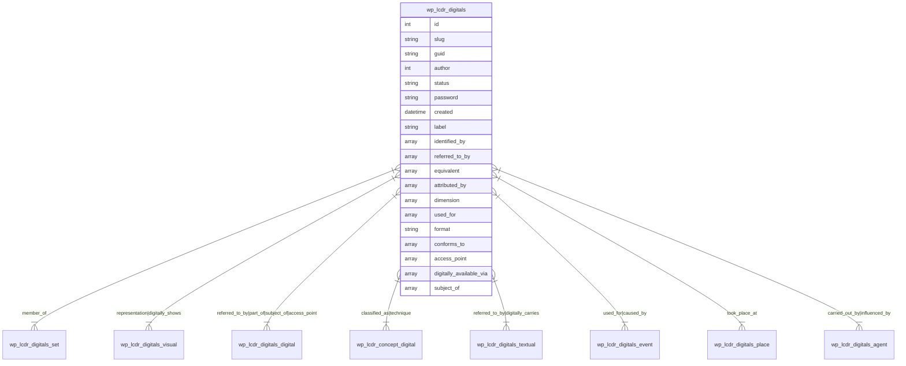

```mermaid

    erDiagram
        wp_lcdr_digitals {
            int id
            string slug
            string guid
            int author
            string status
            string password
            datetime created

            string label
            array identified_by
            array referred_to_by
            array equivalent
            array attributed_by
            array dimension
            array used_for
            string format
            array conforms_to
            array access_point
            array digitally_available_via
            array subject_of
        }

        wp_lcdr_digitals }|--|{ wp_lcdr_digitals_set : "member_of"
        wp_lcdr_digitals }|--|{ wp_lcdr_digitals_visual : "representation|digitally_shows"
        wp_lcdr_digitals }|--|{ wp_lcdr_digitals_digital : "referred_to_by|part_of|subject_of|access_point"
        wp_lcdr_digitals }|--|{ wp_lcdr_concept_digital : "classified_as|technique"
        wp_lcdr_digitals }|--|{ wp_lcdr_digitals_textual : "referred_to_by|digitally_carries"
        wp_lcdr_digitals }|--|{ wp_lcdr_digitals_event : "used_for|caused_by"
        wp_lcdr_digitals }|--|{ wp_lcdr_digitals_place : "took_place_at"
        wp_lcdr_digitals }|--|{ wp_lcdr_digitals_agent : "carried_out_by|influenced_by"
```
