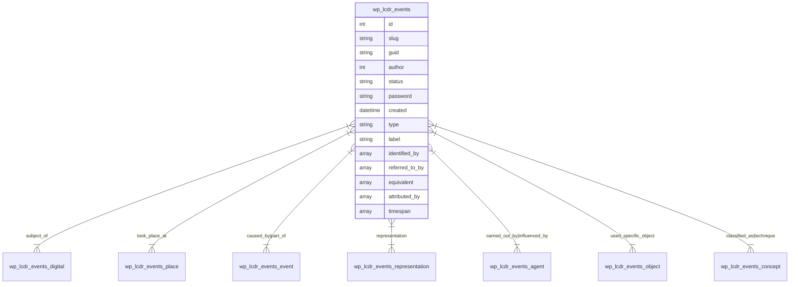

```mermaid

    erDiagram
        wp_lcdr_events {
            int id
            string slug
            string guid
            int author
            string status
            string password
            datetime created

            string type
            string label
            array identified_by
            array referred_to_by
            array equivalent
            array attributed_by
            array timespan
        }

        wp_lcdr_events }|--|{ wp_lcdr_events_digital : "subject_of"
        wp_lcdr_events }|--|{ wp_lcdr_events_place : "took_place_at"
        wp_lcdr_events }|--|{ wp_lcdr_events_event : "caused_by|part_of"
        wp_lcdr_events }|--|{ wp_lcdr_events_representation : "representation"
        wp_lcdr_events }|--|{ wp_lcdr_events_agent : "carried_out_by|influenced_by"
        wp_lcdr_events }|--|{ wp_lcdr_events_object : "used_specific_object"
        wp_lcdr_events }|--|{ wp_lcdr_events_concept : "classified_as|technique"

```
