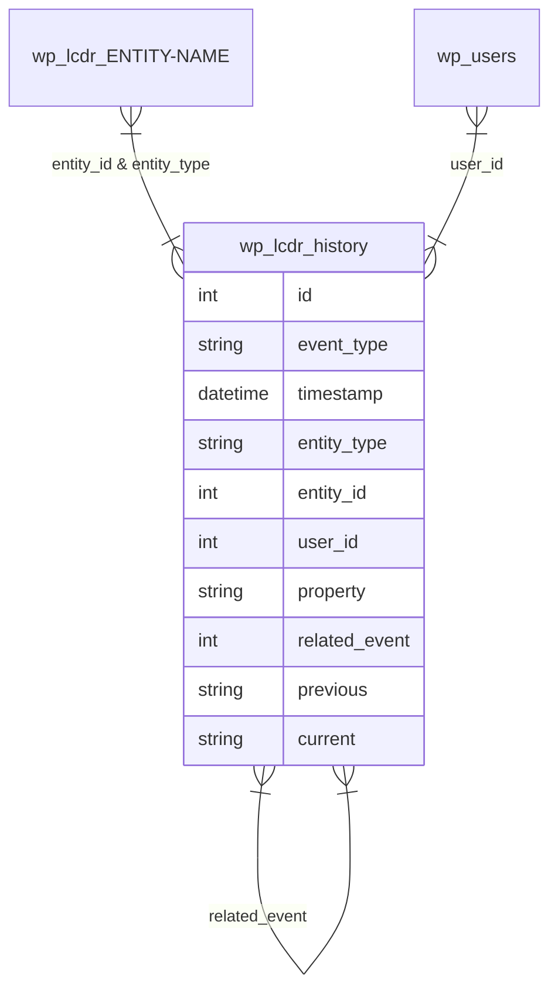

```mermaid
    erDiagram
        wp_lcdr_history {
            int id
            string event_type
            datetime timestamp
            string entity_type
            int entity_id
            int user_id
            string property
            int related_event
            string previous
            string current
        }

        wp_lcdr_history }|--|{ wp_lcdr_history : "related_event"

        wp_lcdr_ENTITY-NAME }|--|{ wp_lcdr_history : "entity_id & entity_type"

        wp_users }|--|{ wp_lcdr_history : "user_id"
```
