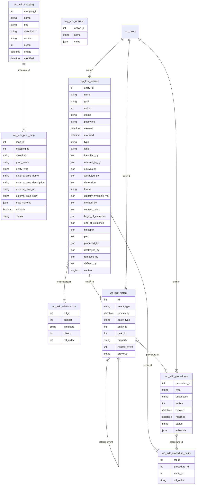

```mermaid
    erDiagram
        wp_lcdr_mapping {
            int mapping_id
            string name
            string title
            string description
            string version
            int author
            datetime create
            datetime modified
        }

        wp_lcdr_prop_map {
            int map_id
            int mapping_id
            string description
            string prop_name
            string entity_type
            string externa_prop_name
            string externa_prop_description
            string externa_prop_uri
            string externa_prop_type
            json map_schema
            boolean editable
            string status
        }

        wp_lcdr_entities {
            int entity_id
            string name
            string guid
            int author
            string status
            string password
            datetime created
            datetime modified
            string type
            string label
            json identified_by
            json referred_to_by
            json equivalent
            json attributed_by
            json dimension
            string format
            json digitally_available_via
            json created_by
            json contact_point
            json begin_of_existence
            json end_of_existence
            json timespan
            json part
            json produced_by
            json destroyed_by
            json removed_by
            json defined_by
            longtext content
        }

        wp_lcdr_relationships {
            int rel_id
            int subject
            string predicate
            int object
            int rel_order
        }

        wp_lcdr_history {
            int id
            string event_type
            datetime timestamp
            string entity_type
            int entity_id
            int user_id
            string property
            int related_event
            string previous
        }

        wp_lcdr_procedures {
            int procedure_id
            string type
            string description
            int author
            datetime created
            datetime modified
            string status
            json schedule
        }

        wp_lcdr_procedure_entity {
            int rel_id
            int procedure_id
            int entity_id
            string rel_order
        }

        wp_lcdr_options {
            int option_id
            string name
            json value
        }

        wp_lcdr_mapping ||--|{ wp_lcdr_prop_map : "mapping_id"

        wp_lcdr_entities }|--|{ wp_lcdr_procedure_entity : "entity_id"
        wp_lcdr_history }|--|{ wp_lcdr_history : "related_event"
        wp_lcdr_history }|--|{ wp_lcdr_procedures : "procedure_id"
        wp_lcdr_entities }|--|{ wp_lcdr_relationships : "subject|object"

        wp_lcdr_procedures }|--|{ wp_lcdr_procedure_entity : "procedure_id"
        wp_lcdr_entities ||--|{ wp_lcdr_history : "entity_id"

        wp_users ||--|{ wp_lcdr_history : "user_id"
        wp_users ||--|{ wp_lcdr_procedures : "author"
        wp_users ||--|{ wp_lcdr_entities : "author"
```
