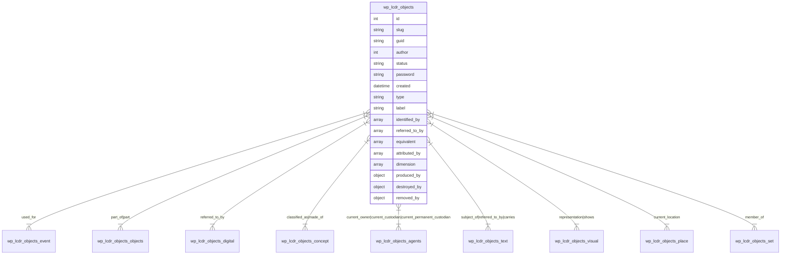

```mermaid
    erDiagram
        wp_lcdr_objects {
            int id
            string slug
            string guid
            int author
            string status
            string password
            datetime created

            string type
            string label
            array identified_by
            array referred_to_by
            array equivalent
            array attributed_by

            array dimension

            object produced_by
            object destroyed_by
            object removed_by
        }

        wp_lcdr_objects }|--|{ wp_lcdr_objects_event : "used_for"
        wp_lcdr_objects }|--|{ wp_lcdr_objects_objects : "part_of|part"
        wp_lcdr_objects }|--|{ wp_lcdr_objects_digital : "referred_to_by"
        wp_lcdr_objects }|--|{ wp_lcdr_objects_concept : "classified_as|made_of"
        wp_lcdr_objects }|--|{ wp_lcdr_objects_agents : "current_owner|current_custodian|current_permanent_custodian"
        wp_lcdr_objects }|--|{ wp_lcdr_objects_text : "subject_of|referred_to_by|carries"
        wp_lcdr_objects }|--|{ wp_lcdr_objects_visual : "representation|shows"
        wp_lcdr_objects }|--|{ wp_lcdr_objects_place : "current_location"
        wp_lcdr_objects }|--|{ wp_lcdr_objects_set : "member_of"
```
