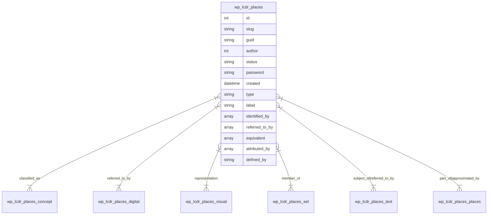

```mermaid
    erDiagram
        wp_lcdr_places {
            int id
            string slug
            string guid
            int author
            string status
            string password
            datetime created

            string type
            string label
            array identified_by
            array referred_to_by
            array equivalent
            array attributed_by

            string defined_by
        }

        wp_lcdr_places }|--|{ wp_lcdr_places_concept : "classified_as"

        wp_lcdr_places }|--|{ wp_lcdr_places_digital : "referred_to_by"
        wp_lcdr_places }|--|{ wp_lcdr_places_visual : "representation"
        wp_lcdr_places }|--|{ wp_lcdr_places_set : "member_of"

        wp_lcdr_places }|--|{ wp_lcdr_places_text : "subject_of|referred_to_by"
        wp_lcdr_places }|--|{ wp_lcdr_places_places : "part_of|approximated_by"
```
