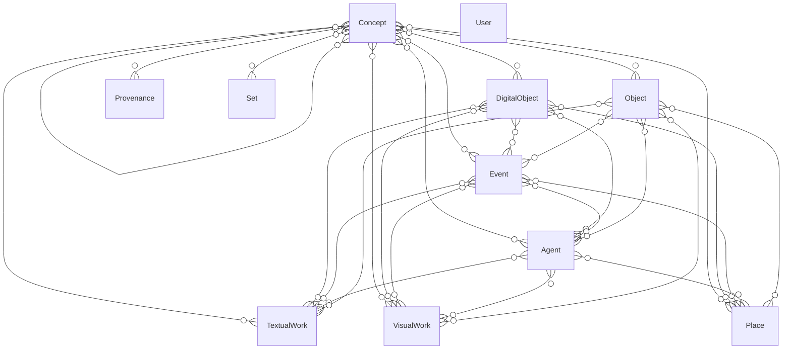

```mermaid
erDiagram
   Concept
   DigitalObject
   Event
   Agent
   Object
   Place
   Provenance
   Set
   TextualWork
   VisualWork

   User

    Concept }o--o{ Concept : ""
    Concept }o--o{ DigitalObject : ""
    Concept }o--o{ Event : ""
    Concept }o--o{ Agent : ""
    Concept }o--o{ Object : ""
    Concept }o--o{ Place : ""
    Concept }o--o{ Provenance : ""
    Concept }o--o{ Set : ""
    Concept }o--o{ TextualWork : ""
    Concept }o--o{ VisualWork : ""

    DigitalObject }o--o{ TextualWork : ""
    DigitalObject }o--o{ VisualWork : ""
    DigitalObject }o--o{ Place : ""
    DigitalObject }o--o{ Event : ""
    DigitalObject }o--o{ Agent : ""

    Event }o--o{ VisualWork : ""
    Event }o--o{ TextualWork : ""
    Event }o--o{ Place : ""
    Event }o--o{ Agent : ""

    Agent }o--o{ VisualWork : ""
    Agent }o--o{ TextualWork : ""
    Agent }o--o{ Place : ""

    Object }o--o{ VisualWork : ""
    Object }o--o{ TextualWork : ""
    Object }o--o{ Agent : ""
    Object }o--o{ Place : ""
    Object }o--o{ Event : ""
```
