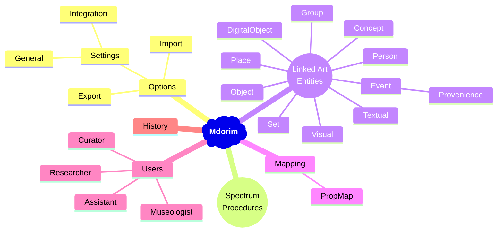

```mermaid
    mindmap
        root)"**Mdorim**"(
            Options
                Import
                Export
                Settings
                    General
                    Integration
            Procedures(("Spectrum
            Procedures"))
            entities(("Linked Art
            Entities"))
                Object
                Concept
                DigitalObject
                Textual
                Visual
                Person
                Group
                Event
                    Provenience
                Place
                Set
            Mapping
                PropMap
            Users
                Curator
                Museologist
                Assistant
                Researcher
            History
```
