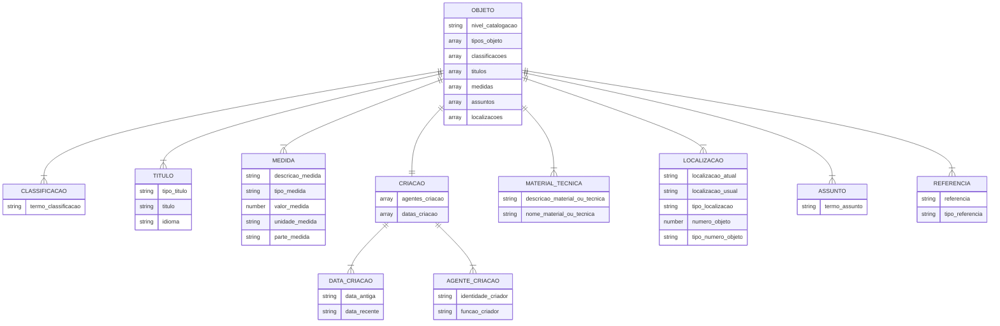

```mermaid
    erDiagram
        OBJETO ||--|{ CLASSIFICACAO : ""
        OBJETO ||--|{ TITULO : ""
        OBJETO ||--|{ MEDIDA : ""
        OBJETO ||--|| CRIACAO : ""
        OBJETO ||--|{ MATERIAL_TECNICA : ""
        OBJETO ||--|{ LOCALIZACAO : ""
        OBJETO ||--|{ ASSUNTO : ""
        OBJETO ||--|{ REFERENCIA : ""
        CRIACAO ||--|{ DATA_CRIACAO : ""
        CRIACAO ||--|{ AGENTE_CRIACAO : ""

        REFERENCIA {
            string referencia
            string tipo_referencia
        }
        LOCALIZACAO {
            string localizacao_atual
            string localizacao_usual
            string tipo_localizacao
            number numero_objeto
            string tipo_numero_objeto
        }
        ASSUNTO {
            string termo_assunto
        }
        MATERIAL_TECNICA {
            string descricao_material_ou_tecnica
            string nome_material_ou_tecnica
        }
        MEDIDA {
            string descricao_medida
            string tipo_medida
            number valor_medida
            string unidade_medida
            string parte_medida
        }
        CRIACAO {
            array agentes_criacao
            array datas_criacao
        }
        AGENTE_CRIACAO {
            string identidade_criador
            string funcao_criador
        }
        DATA_CRIACAO {
            string data_antiga
            string data_recente
        }
        OBJETO {
            string nivel_catalogacao
            array tipos_objeto
            array classificacoes
            array titulos
            array medidas
            array assuntos
            array localizacoes
        }
        CLASSIFICACAO {
            string termo_classificacao
        }
        TITULO {
            string tipo_titulo
            string titulo
            string idioma
        }
```
