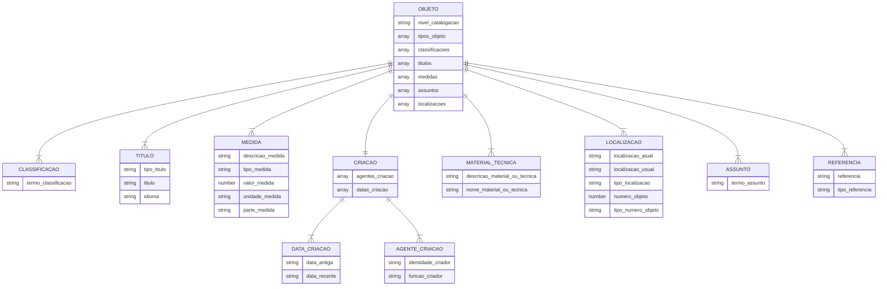

## 4.1.1. Metadados de representação e descrição de itens museológicos

Neste capítulo analisaremos os padrões de metadados desenvolvidos por Silva (2020) em sua tese de doutorado: Esquema de metadados para descrição de obras de arte em museus brasileiros: uma proposta, Object ID (1997) desenvolvido pelo Getty Information Institute e o Linked Art (2021), padrão de metadados desenvolvido pelo Grupo de Trabalho do CIDOC-ICOM Linked Art, formado por Robert Sanderson, Athanasios Velios e Emmanuelle Delmas-Glass. Analisaremos também os procedimentos de gestão de coleções Standard Procedures for Collections Recording Used in Museums - SPECTRUM (2007), mantido pelo Collections Trust, organização sediada no Reino Unido com foco na criação de padrões internacionais de documentação museológica. A partir da análise dos padrões, iremos propor o conjunto de metadados básico para gestão e divulgação de coleções que usaremos no Elucidário.art.

### 4.1.1.1 - Esquema de metadados para descrição de obras de arte em museus brasileiros: uma proposta. [@silva2020]

Silva (2020), para o desenvolvimento de seu esquema de metadados, utiliza como referência os conjunto de metadados do *Categories for the Description of Works of Art* (CDWA) mantido pelo *Getty Vocabulary Program* (GVP), nas Categorias de Informação do Comitê Internacional de Documentação (CIDOC-ICOM) e nos grupos de informações da norma SPECTRUM. A partir daí, Silva apresenta 9 grupos de informações e 25 unidades de informação para descrição e representação de obras de arte, considerados mínimos pela autora, para os museus brasileiros. Na fig.1, representação em *Unified Modeling Language* (UML) do esquema,  vemos os 9 grupos de informações na linha central e no OBJETO localizado acima de todos—e por onde todos os outros grupos de informações convergem—, os dois elementos de baixo são as subunidades de informação da unidade de informação CRIAÇÃO, os grupos de informações listados no centro são: CLASSIFICACAO, TITULO, MEDIDA, CRIACAO, MATERIAL_TECNICA, LOCALIZACAO, ASSUNTO E REFERENCIA. Cada grupo de informação possui um conjunto de unidades de informações, à esquerda de cada grupo está listado o tipo de informação da unidade: string para texto, number para números, e array para listas. As conexões com dois traços cruzados ( || ) são referentes a presença obrigatória de ao menos um registro, as com um traço e uma chave ( |{ ) representam uma ou mais entradas.

---

**Fig.1 - Esquema de metadados para descrição de obras de arte em museus brasileiros: uma proposta. (SILVA, 2020)**

**Fonte:** Elaborado pelo autor, com base em SILVA, Camila (2020).

---

### 4.1.1.2 - Object ID (1997)

O Object ID é um padrão de documentação para descrever coleções de itens arqueológicos, culturais e artísticos (OBJECT ID, 1997). Foi criado com o objetivo de identificar o patrimônio cultural para evitar roubos e contrabandos e, por isso, é promovido por diversas agências governamentais como FBI, *Scotland Yard*, *Interpol*, e organizações como *World Customs Organization* (WCO) e *The United Nations Educational, Scientific and Cultural Organization* (UNESCO) [@conselho-internacional-de-museus-icom1999].

O Object ID define 9 (nove) categorias de informações e 4 (quatro) passos para a documentação. As categorias são:

1. ***Type of object*** - qual o tipo do objeto? (pintura, gravura, escultura, etc);
2. ***Materials and techniques*** - de que materiais o objeto é feito? Como ele foi feito?
3. ***Measurement*** - qual o tamanho e/ou o peso do objeto?
4. ***Inscriptions and markings*** - existem marcas de identificação, números ou inscrições no objeto?
5. ***Distinguishing features*** - alguma característica física especial que ajude a identificar? (danos, reparos, defeitos de fabricação, etc);
6. ***Title*** - o objeto tem um título pelo qual é conhecido?
7. ***Subject*** - o que está sendo representado no objeto?
8. ***Date or period*** - quando o objeto foi feito?
9. ***Maker*** - quem produziu o objeto?

Os quatro passos do Object ID para a documentação são:

1. Tirar fotografias do objeto;
2. Identificar as 9 categorias de informações acima;
3. Escrever uma descrição, incluindo informações adicionais; e
4. Armazenar a documentação em local seguro.

Na reunião do Grupo de Trabalho - DocumentandO Museu IberoamericaNO (DOMINO) do CIDOC-ICOM realizada no dia 22 de maio de 2022 [@domino2021], como parte das atividades da Conferência CIDOC Tallinn 2021, foi defendido pelos integrantes que o Object ID seja o padrão mínimo adotado por um museu para sua documentação, devido a sua simplicidade e reconhecimento por autoridades mundiais. O DOMINO tem como objetivo disseminar o trabalho do CIDOC para as comunidades dos idiomas português e espanhol, e servir como uma ponte linguística para troca de conhecimento especializado [@intenational-committee-for-documentaion2018].
