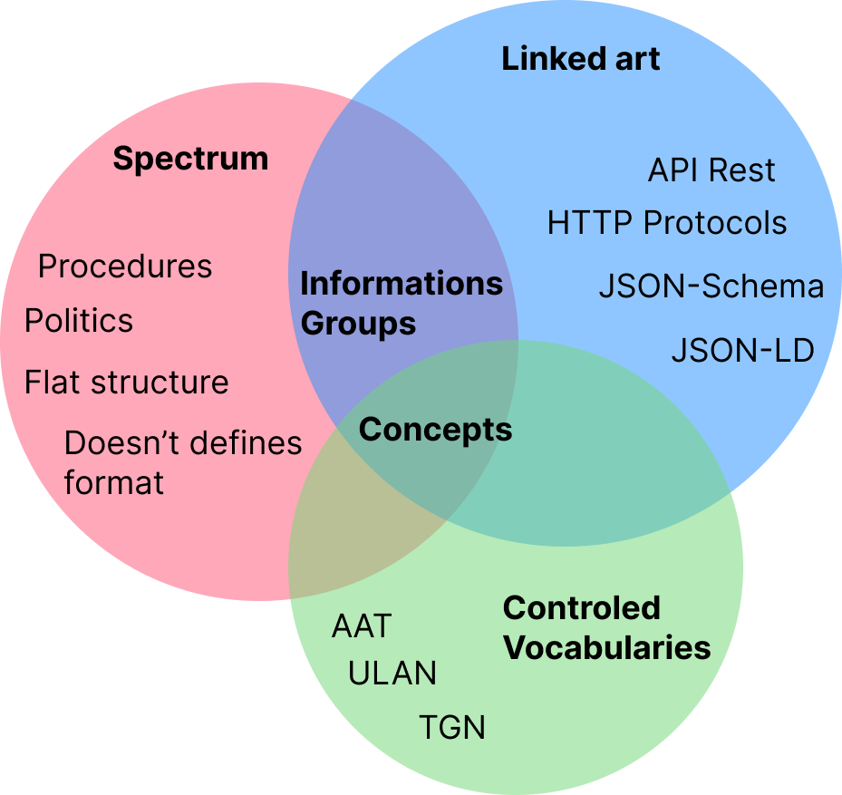

# Intersections between Linked Art and Spectrum

But why did we choose to use these two standards in Mdorim?

Linked Art was chosen because it is a standard for describing cultural heritage focused on interoperability and can be used by 90% of organizations in 90% of cases. Spectrum was chosen due to the procedures used to represent the workflows of Elucidario.art.

{{table:comparison.json}}

In this table, we can see a brief comparison between the two models.

**Figure 1** - Intersections between Spectrum and Linked Art.

**Source:** Developed by the authors.

The above image demonstrates the importance of using controlled vocabularies to provide more context for metadata in Linked Art. For example, the _identified_by_ property in Linked Art is the standard way to identify any class defined by the model, such as _Object_, _Concept_, _DigitalObject_, _Event_, and others. It accepts an array of objects that can be either _Identifiers_ or _Names_ that have the _classified_as_ property - an array of _Concept_ objects representing the concepts identified by the content of the property:

**Table 2**: Identification of an object, demonstrates the _identified_by_ property with an array of _Identifier_ and _Name_ objects and their _classified_as_ properties.

{{code:rj-tarsila-linked-art.json}}

**Source:** Developed by the authors. Based on Linked Art, it describes Tarsila do Amaral's work "Rio de Janeiro" from the Ema Klabin Collection.

On the other hand, Spectrum defines specialized fields for the type of identification we are performing [@collections-trust2017.4]:

{{table:rj-tarsila-spectrum.json}}

In this way, Mdorim presents the `Mapping` and `PropMap` entities responsible for recording and storing the mapping between the two models, as we can see in the table below:

{{table:model-mapping.json}}

{{table:model-prop-map.json}}

With these two entities, we allow the user to perform as many mappings as necessary to represent their collection, including mapping between others models.
The `map_value` property stores a pre-populated Linked Art property, leaving the responsibility for the user to complete the missing information, like `content` in an `Identifier` object.

These entities are also used by the system to define which fields will be used for data import and export.

For Spectrum procedures, we created a new entity called `Procedure`, responsible for storing information about each performed procedure:

{{table:model-procedure.json}}

With this entity, we allow the recording of information about each procedure, creation and update dates, the responsible user, status, procedure type - which can be any of the 21 procedures defined in Spectrum, and other information, such as entities related to the procedure, like `Object` for example. `Schedule` is another object that defines a procedure schedule, which can be set to repeat daily, weekly, monthly (or another time interval), or even only at a specific moment. In `data`, we record the Spectrum Procedure Information Group in JSON format.
