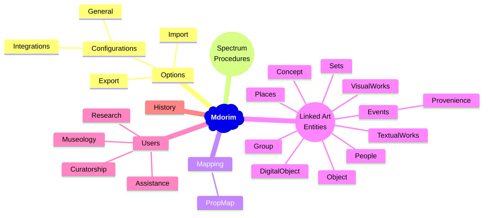

```mermaid
    mindmap
        root)"**Mdorim**"(
            Options
                Import
                Export
                Configurations
                    General
                    Integrations
            Procedures(("Spectrum
            Procedures"))
            Mapping
                PropMap
            entidades(("Linked Art
            Entities"))
                Object
                Concept
                DigitalObject
                TextualWorks
                VisualWorks
                People
                Group
                Events
                    Provenience
                Places
                Sets
            Users
                Curatorship
                Museology
                Assistance
                Research
            History
```
