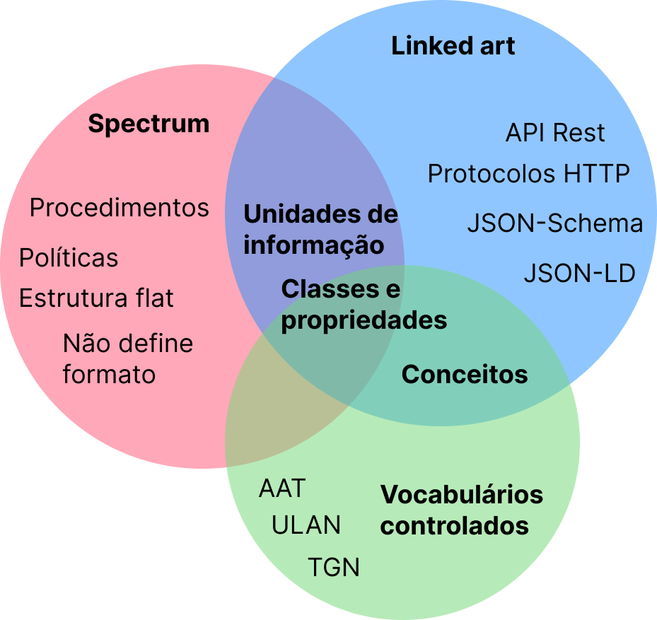

# Interseccoes entre Linked Art e Spectrum

Mas por que optamos por utilizar estes dois padrões no Mdorim?

O Linked Art foi escolhido por ser um padrão para descrever o patrimônio cultural focado na interoperabilidade e que pode ser utilizado por 90% das organizações em 90% dos casos. Já o Spectrum foi escolhido por conta dos procedimentos que são utilizados para representar os fluxos de trabalho do Elucidario.art.

{{table:comparativo.json}}

Nessa tabela podemos ver um breve comparativo entre os dois modelos.

**Figura 1** - Intersecções entre o Spectrum e o Linked Art.

**Fonte:** Elaborado pelos autores.

A imagem acima demonstra a importância do uso de vocabulários controlados para trazer mais contexto para os metadados no Linked Art, como por exemplo a propriedade _identified_by_ do Linked Art é a forma padrão de identificação de qualquer classe definida pelo modelo, como _Object_, _Concept_, _DigitalObject_, _Event_, entre outras. Ela aceita um array de objetos que podem ser ou _Identifiers_ ou _Names_ que possuem a propriedade _classified_as_— um array de objetos _Concept_ que representam os conceitos identificados pelo _content_ da propriedade:

**Quadro 2**: Identificação de um objeto, demonstra a propriedade _identified_by_ com um array de objetos _Identifier_ e _Name_ e suas propriedades _classified_as_.

{{code:rj-tarsila-linked-art.json}}

**Fonte**: Elaborado pelos autores. Baseado no Linked Art, descreve a obra Rio de Janeiro de Tarsila do Amaral da Coleção Ema Klabin.

Já o Spectrum define campos especializados para o tipo de identificação que estamos realizando [@collections-trust2017.4]:

{{table:rj-tarsila-spectrum.json}}

Dessa forma, o Mdorim apresenta a entidade `Mapping` e `PropMap` responsáveis por registrar e armazenar o mapeamento entre os dois modelos, como podemos ver no quadro abaixo:

{{table:model-mapping.json}}

{{table:model-prop-map.json}}

Com essas duas entidades permitimos que o usuário consiga realizar quantos mapeamentos achar necessário para representação de sua coleção, inclusive o mapeamento entre modelos diferentes do Spectrum. Essas entidades também são usadas pelo sistema para definir quais campos serão utilizados para a importação e exportação de dados.

Para os procedimentos do Spectrum, criamos uma nova entidade chamada `Procedure`, responsável por armazenar as informações de cada procedimento realizado:

{{table:model-procedure.json}}

Com esta entidade, permitimos o registro das informações de cada procedimento realizado, como o tipo de procedimento, a data de criação e edição, o usuário responsável, o status, o tipo de procedimento - podendo ser qualquer um dos 21 procedimentos definidos no Spectrum, e outras informações, como as entidades relacionadas ao procedimento, como `Object` por exemplo. `Schedule` é um outro objeto que define um cronograma do procedimento, que pode ser definido para repetir diariamente, semanalmente, mensalmente (ou outro intervalo de tempo), ou apenas em um momento específico, já em `data` registramos em formato JSON os o Grupo de Informações de Procedimento do Spectrum.  
