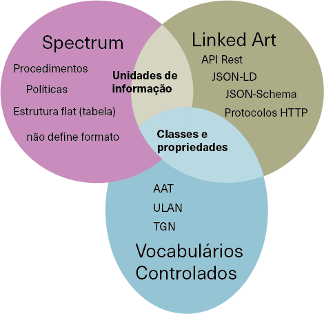

# Interseccoes entre Linked Art e Spectrum

Como vimos nas seções anteriores, o Spectrum define um conjunto de procedimentos e unidades de informação, em que as unidades de informação são bastantes especializadas, como "Object name" ou "Conservation authorization date", o que por si só já traz contexto. O Spectrum também não determina o formato de registro das informações: se devemos utilizar tabelas em CSV, MYSQL, XML, RDF, ou qualquer outro formato para dados,

Em contrapartida, o Linked Art utiliza o formato JSON, mais especificamente o JSON-LD e define uma estrutura comum que é compartilhada por diversas propriedades e adiciona uma camada semântica com o uso de vocabulários controlados para definição dos conceitos descritos.

Para o mapeamento entre o Spectrum e o Linked Art, selecionamos apenas as unidades de informação do Spectrum, uma vez que os procedimentos são atividades que vão além do registro em si, mas suas informações ainda podem ser representados pelo Linked Art, como veremos mais adiante. Também selecionamos as Classes e propriedades do Linked Art, que necessitam da contextualização de um vocabulário controlado como pode ser visto na Figura 1.

**Figura 1** - Intersecções entre o Spectrum e o Linked Art.



**Fonte:** Elaborado pelos autores.

A imagem acima demonstra a importância do uso de vocabulários controlados para trazer mais contexto para os metadados no Linked Art, como por exemplo a propriedade *identified_by* do Linked Art é a forma padrão de identificação de qualquer classe definida pelo modelo, como *Object*, *Concept*, *Digital* *Object*, *Event*, entre outras. Ela aceita um array de objetos que podem ser ou *Identifiers* ou *Names* que possuem a propriedade *classified_as*, um array de objetos *Concept* que representam os conceitos identificados pelo *content* da propriedade:

**Exemplo x**: Identificação de um objeto, demonstra a propriedade *identified_by* com um array de objetos *Identifier* e *Name* e suas propriedades *classified_as*.

```json
{
    "identified_by": [
        {
            "type": "Identifier",
            "_label": "Accession Number",
            "classified_as": [
                {
                    "id": "http://vocab.getty.edu/aat/300404621",
                    "_label": "Accession Number"
                }
            ],
            "content": "M-0821"
        },
        {
            "type": "Name",
            "_label": "Title",
            "classified_as": [
                {
                    "id": "http://vocab.getty.edu/aat/300404621",
                    "_label": "Title"
                }
            ],
            "content": "Rio de Janeiro"
        }
    ]
}
```

**Fonte**: Elaborado pelos autores. Baseado no Linked Art, descreve a obra Rio de Janeiro de Tarsila do Amaral.

Já o Spectrum define campos especializados para o tipo de identificação que estamos realizando, seja de um objeto [@collections-trust2017.4]:

- *Object Name*;
- *Object Number*;
- *Title*;
- *Other Number*.

Ou de uma pessoa [@collections-trust2017.5]:

- Person's reference number;
- Person's forename;
- Person's surname;
- Person's title;
- entre outras.
